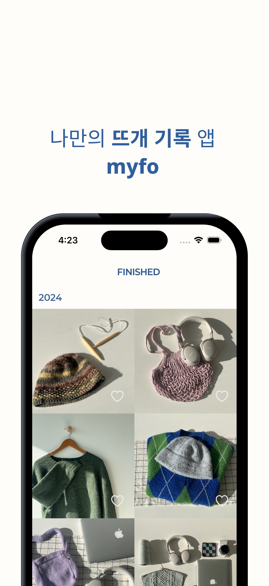
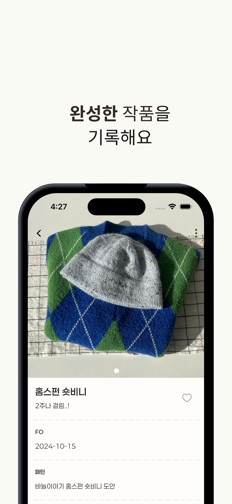
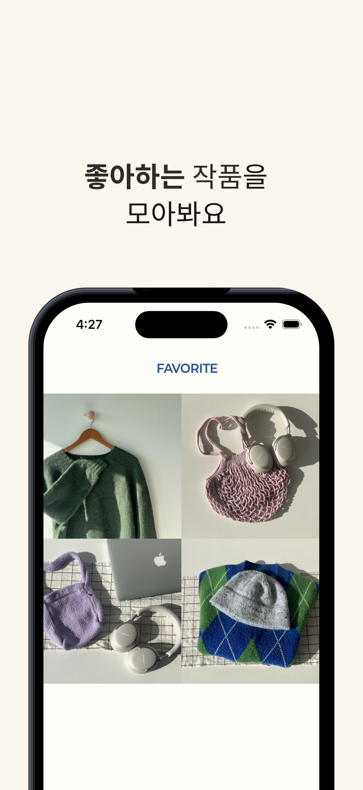

# myfo







##### 나만의 뜨개 기록 앱 myfo

FO는 Finished Object로 뜨개인 사이에서 **완성한 뜨개 작품**을 의미해요.

여기에 **Favorite Object라는 의미를 더해 myfo** 라는 이름을 지었습니다.

## 서비스 소개
```
적게는 하루, 길면 일년 이상 시간을 들여 완성한 작품에 대해 기록해서 완성의 기쁨을 간직해봐요 🧶
```
뜨개 작품은 적게는 하루, 길면 일년 이상 공들여서 작업하게 됩니다.

작품을 만들면서 느꼈던 감정, 새롭게 알게된 기법, 사용했던 실과 바늘에 대해서 기록하면 다음 작품을 시작할때 도움이 될 수 있습니다.

**아무도 안만들었길래 제가 만들었어요.**

## 사용기술
### Frontend


>  chatGPT의 도움을 많이 받았습니다.

### Backend


## 아키텍쳐

## 기능

1. 작품 기록 저장
   완성한 작품에 대한 정보를 기록할 수 있어요.
2. 작품 리스트
   완성한 작품을 년도별로 정리해 갤러리형태로 둘러볼 수 있어요.
3. 좋아요
   마음에 드는 작품을 모아 컬렉션을 만들 수 있어요.

## 이미지 서버
- myfo-image-api
